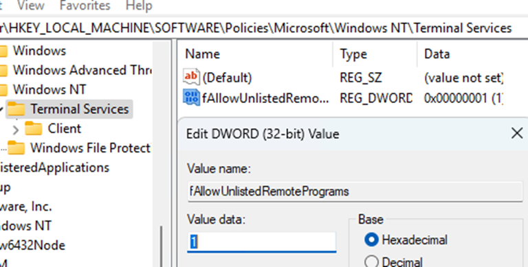

# Windows Configuration

This explains how to enable launching a lab desktop app in kiosk mode, so that Guacamole can better run it using the Remote App option (see the Lab Gateway documentation for more details on this).

The process is really simple and just requires to edit a field in the Windows registry:

regedit: "HKEY\_LOCAL\_MACHINE\SOFTWARE\Policies\Microsoft\Windows NT\Terminal Services" /v fAllowUnlistedRemotePrograms /t REG\_DWORD /d 1

Or, through the UI:

<figure><figcaption></figcaption></figure>
